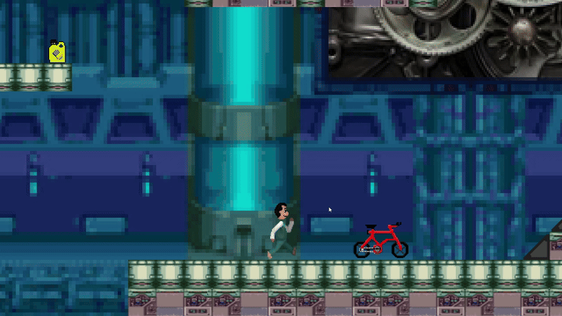

  
  
  
  

  
  

<h1 align="center">🚗🔥 <em>Mr. C vs The Cooling System</em>🔥🚗</h1>
<h3 align="center">A chaotic 2D platformer set inside a car's cooling system, starring your thermodynamics professor!</h3>

  <em>"Where anticoolant guns, rust monsters, and pink bicycles collide."</em>

## 🎮 Game Concept
Help Mr. C (your real-life automotive professor!) navigate the treacherous depths of a car’s cooling system. Armed with antifreeze bullets, battle flame enemies, rust monsters, and corrosive hazards. Inspired by a real automotive class project — because learning thermodynamics should be fun.

## ✨ Key Features
- Mr. C as the Hero: Pixel-art sprites of your professor-turned-action-star.
- Unique Enemies: Flame blobs (overheating), rust monsters (corrosion), and oil slimes.
- Pink Bicycle Checkpoints: Touch a red bike → it turns pink (an ode to your prof’s real-life ride!).
- Cooling System Mechanics: Platforms made of hoses, radiators as trampolines, and coolant pools.
- Retro Pixel Art: Hand-drawn sprites and vibrant UI.

## 🖼️ Screenshots

### Checkpoint

   

 

### Shooting

   

 

### Special Item Recollection

   

 

### Recharge

   

 

### Floating Platform

   

 

## 🛠️ Technologies Used
- GameMaker Studio: Core game logic and level design.
- Pixel-art sprites and animations.
- Physics: Custom collision systems for slippery coolant pools.

## 📚 Project Context
Developed as a final project for Automotive Cooling Systems class in high school (Technical Automotive Program).
The goal was to gamify thermodynamics concepts while paying homage to our teacher’s quirks (hence the pink bikes!).

## 🚀 How to Play
Download: download the .exe from Releases.
Run: Execute mr_c_cooling_system.exe (Windows only).

Controls:
- Arrow Keys: Move
- Up Arrow: Jump
- Space Bar: Shoot antifreeze

## 🌟 Why This Project?
- Portfolio Gold: Demonstrates game design, programming, and pixel art.
- Nostalgia Factor: A fun tribute to your teacher and classmates.
- Technical Twist: Reimagines real-world automotive systems as game mechanics.

📜 Credits
Programming & Design: Francisco Garcia Solis
Pixel Art: Francisco Garcia Solis / Angel Antonio Galvan Santibanez
Special Thanks: Mr. C (for the inspiration and pink bike stories!).

*"Game development is like a car’s cooling system: if you don’t manage the heat, everything breaks."*

## 🔧 Want to Extend This Project?
- Add more enemy types (e.g., "Thermostat Boss").
- Implement a coolant temperature meter (gameplay mechanic).
- Port to Android (touch controls for shooting).
